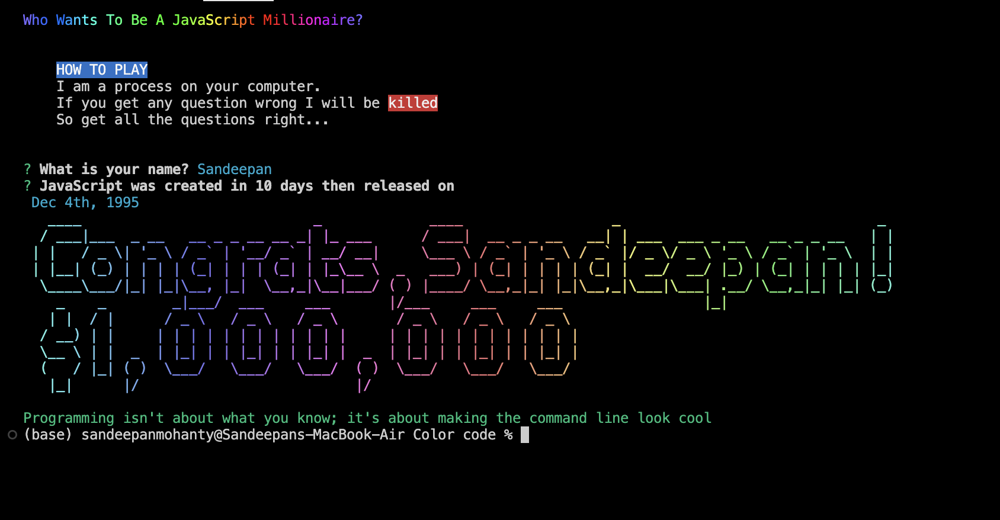

# CLI QUIZ tool

A super fancy CLI tool. 

 ## Screenshot
<td width="45%"><p align="left" >  </p>
 


## Take the Quiz

```
npm i sanquiz
```
```
npm sanquiz
```
## Packages Used

[chalk](https://github.com/chalk/chalk) | 
[inquirer](https://github.com/SBoudrias/Inquirer.js) |
[gradient-string](https://github.com/bokub/gradient-string) |
[chalk-animation](https://github.com/bokub/chalk-animation) |
[figlet](https://github.com/patorjk/figlet.js) |
[nanospinner](https://github.com/usmanyunusov/nanospinner)


```sh
npm i chalk chalk-animation figlet gradient-string inquirer nanospinner
```
